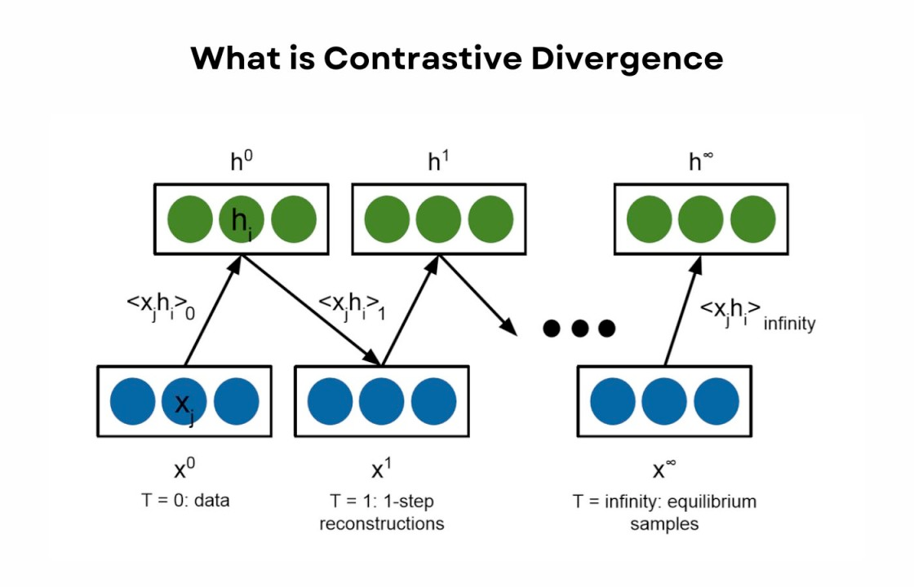

# RBMs and DBNs

Restricted Boltzmann Machines (RBMs) + Deep Belief Networks (DBNs) - An RBM are simple 2-layer generative models, that are trained here using an unsupervised learning algorithm called contrastive divergence, during which, the optimizers goal is to be able to reconstruct samples that fall within the distribution of the input samples, X, by sampling the output of the model. In doing so, the model develops an in-depth understanding of the internal structure of the data.\
RBMs can also be stacked together, to create a deep architecture called a Deep Belief Network (Hinton et al., 2006). Because of the nature of RBMs, the training process of DBNs can be done in a layer-wise fashion, making it less resource hungry than typical backpropagation-based model training techniques. SIT-FUSE allows for DBNs to be used as well as simple RBMs

<figure><figcaption>
A diagram depicting contrastive divergence
</figcaption></figure>

<figure><figcaption>
A depiction of stacked RBMs, creating  DBNs
</figcaption></figure>

References:

1. Hinton, G. E. (2012). A Practical Guide to Training Restricted Boltzmann Machines.. In G. Montavon, G. B. Orr & K.-R. Müller (ed.), _Neural Networks: Tricks of the Trade (2nd ed.)_ , Vol. 7700 (pp. 599-619) . Springer . ISBN: 978-3-642-35288-1.
2. Carreira-Perpinan, M. A. & Hinton, G. E. (2005). On Contrastive Divergence Learning . In Intelligence, A. & Statistics, 2005, B. (ed.), .
3. Renjie Liao, Simon Kornblith, Mengye Ren, David J. Fleet, Geoffrey Hinton: “Gaussian-Bernoulli RBMs Without Tears”, 2022; [arXiv:2210.10318](http://arxiv.org/abs/2210.10318).

