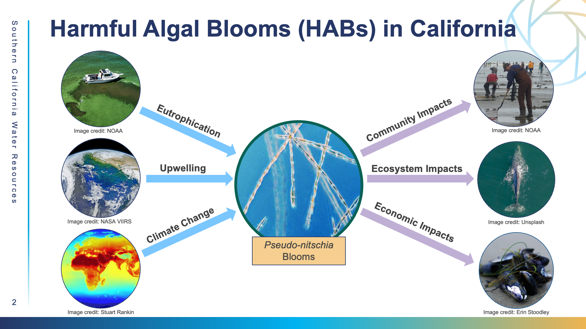
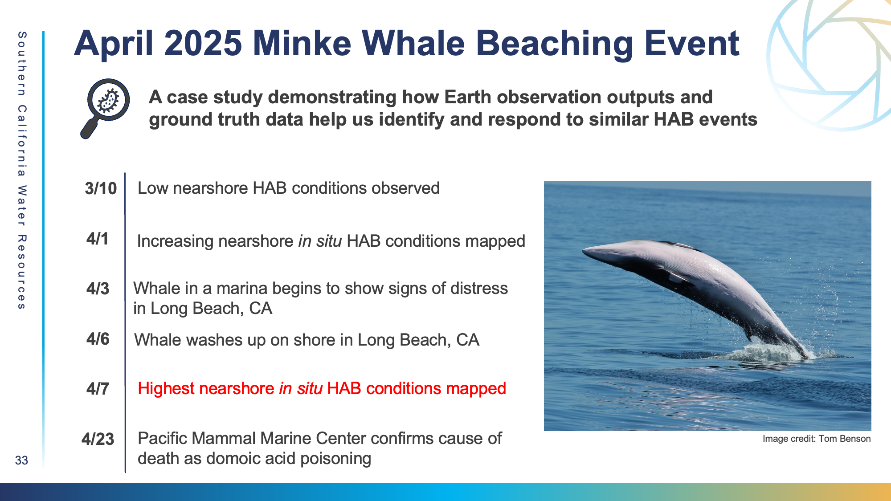
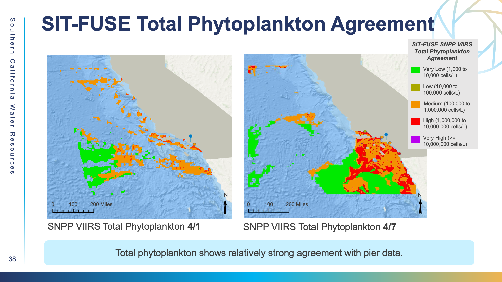
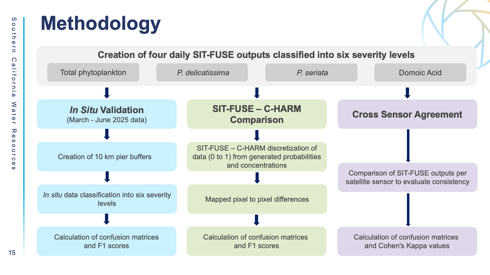
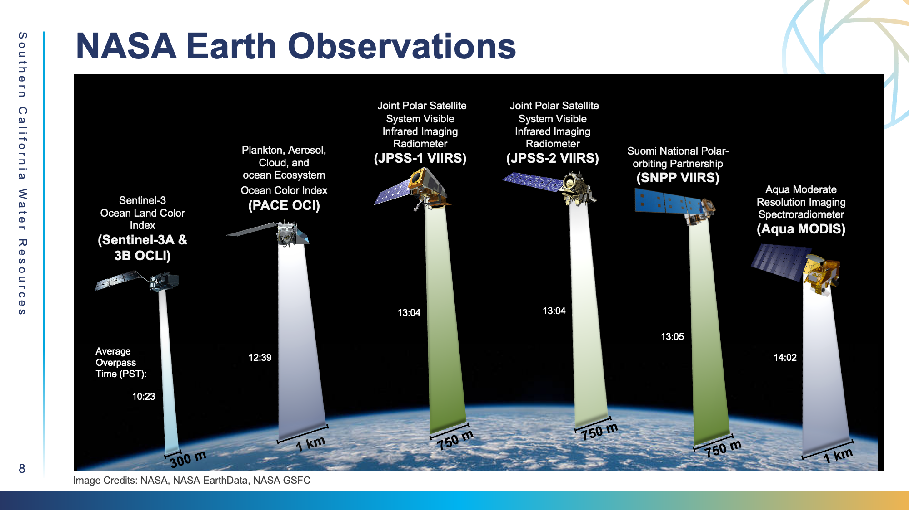
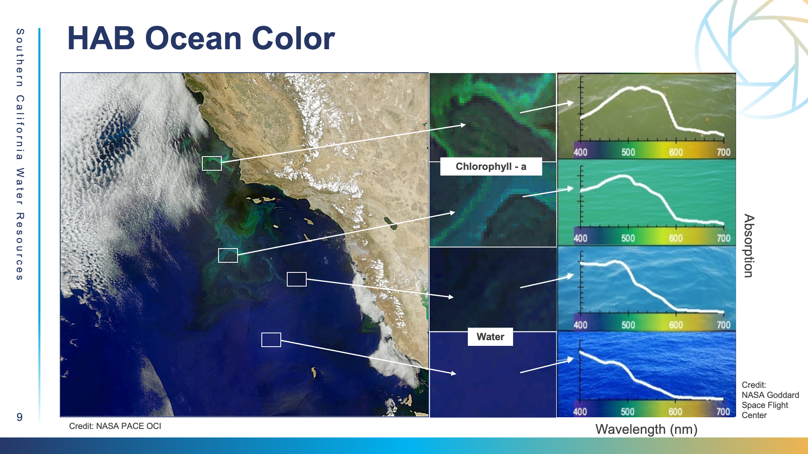
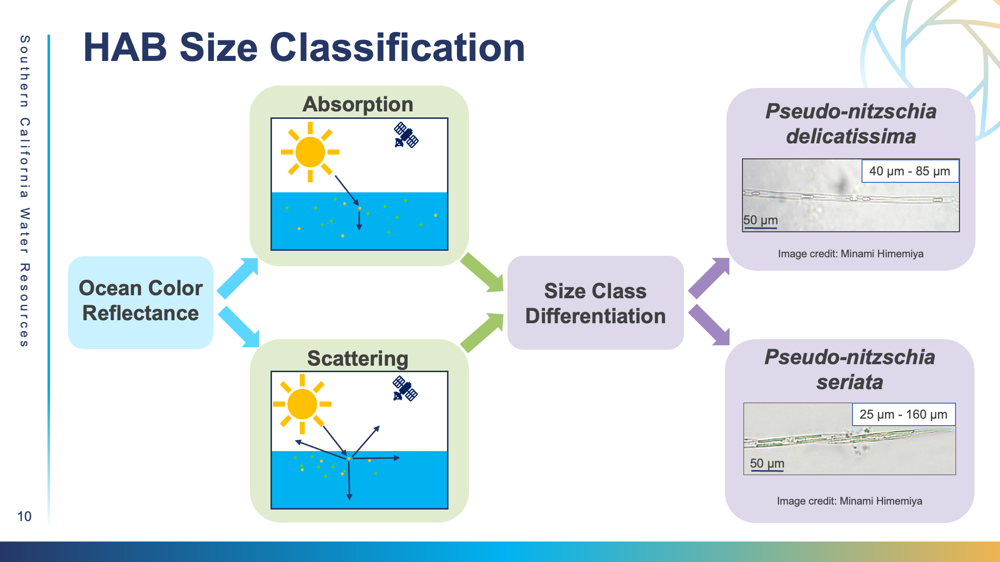
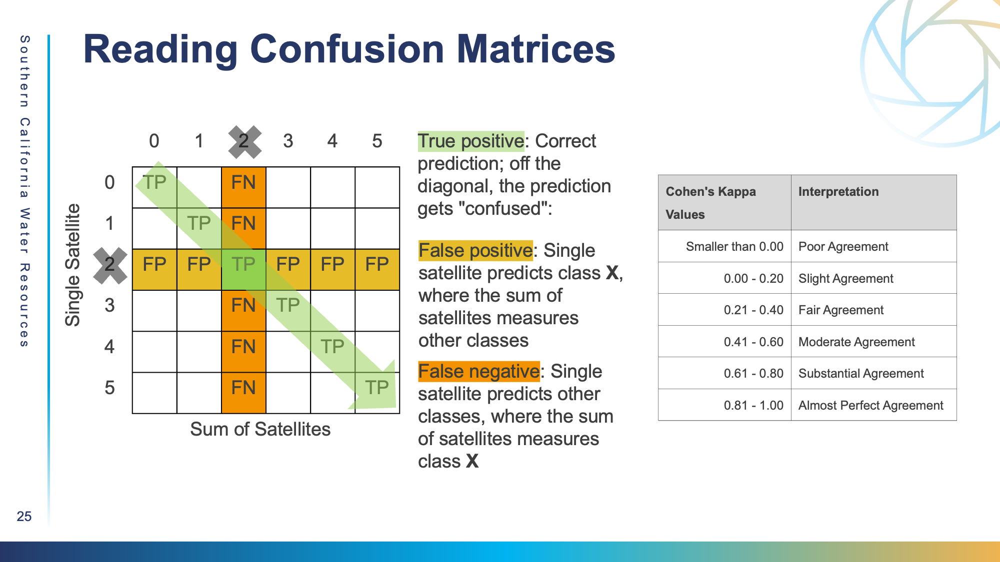

# Harmful Algal Blooms

### **Project Overview**&#x20;

The novel SIT-FUSE framework has demonstrated immense potential when it comes to accurately predicting Harmful Algal Blooms. As a part of the NASA Earthrise Developer’s Academy, the Southern California Water Resources team conducted a thorough evaluation of SIT-FUSE's potential. This project partnered with the Southern California Coastal Ocean Observing System and the California HAB Monitoring & Alert Program to integrate NASA Earth Observation satellite and sensor data for Harmful Algal Bloom (HAB) detection along the Southern California coast. We generated SIT-FUSE outputs from March 2024 to June 2025. &#x20;

#### **Why HABs?**&#x20;

<figure><figcaption></figcaption></figure>

Harmful algal bloom events (HABs) occur when algae rapidly proliferate and over accumulate. They can then pose a growing threat to community and ecosystem health and economic prosperity. These blooms are becoming more widespread due to nutrient enrichment from fertilizer runoff and seasonal upwelling, increased freshwater inputs, and climate-driven warming and ocean stratification (Carias et al., 2024; Trainer et al., 2020; U.S. National Office for Harmful Algal Blooms, n.d.) _Pseudo-nitzschia spp_., a toxic diatom, is of particular concern during HAB events off the coast of California, where blooms cause domoic acid accumulation in shellfish. Biomagnification of this toxin can result in Amnesic Shellfish Poisoning in humans and threaten California’s aquaculture, fishing, and tourism industries, as well as the health of neighboring communities (Anderson et al., 2021).

In 2015, scientists recorded an unprecedented _Pseudo-nitzschia spp_. bloom on the U.S. West Coast. The Dungeness crab fishery, the most profitable fishery in the region, reported a $97.5 million decrease in revenue attributable to the blooms (Moore et al., 2020). Several other fisheries— including razor clam, rock crab, anchovy, and mussel— were also impacted, and elevated levels of marine mammal strandings and mortalities were reported (Bowers et al., 2018; Moore et al., 2020;). With 26.8 million people in coastal communities, 40 marine mammal species, 21 shorebird species, and 571 fish species, and extensive fishing and tourism industries, the health of California’s coastal waters are vital (Harris et al. 2026; National Oceanic and Atmospheric Administration, n. d.).&#x20;

#### **The Minke Whale Beaching Case Study**

<figure><figcaption></figcaption></figure>

On October 3, a minke whale began to show signs of distress in Long Beach, CA. On October 6, the whale ended up washing up on shore, and a few weeks later, the cause of death was determined to be domoic acid poisoning. The whale incident was documented by a variety of news outlets and gained a lot of traction.&#x20;

&#x20;\
_&#x43;onnecting this incident back to SIT-FUSE, how can we use Earth Observation data to be able to remotely detect and predict HABs, so we may respond to similar incidents in a timely and effective manner?_ &#x20;

#### **What do SIT-FUSE outputs look like when visualized?**&#x20;

SIT-FUSE outputs, when visualized in a geospatial software (in this case ArcGIS), are an array of pixels stored within a GeoTIFF, each encoded with a specific value (0 to 5) based on how severe the framework predicts the bloom to be at that specific pixel.&#x20;

For phytoplankton concentration, the classes are as follows: &#x20;

**0 - Null** (0-1000 cells/L)

**1 - Very Low** (1,000 to 10,000 cells/L)

**2 - Low** (10,000 to 100,000 cells/L)

**3 - Medium** (100,000 to 1,000,000 cells/L)

**4 - High** (1,000,000 to 10,000,000 cells/L)

**5 - Very High**  (≥ 10,000,000 cells/L)

<figure><figcaption></figcaption></figure>

Thinking about the dates surrounding the Minke Whale Case Study, we visualized the SIT-FUSE outputs for April 1st and April 7th, where there was sufficient data from the Newport Pier, the closest pier to the whale beaching. We classified the different severity values into different colors, aligned with LaHaye, Luis, and Gierach (2026). We also overlaid _in situ_ data from the piers, color coded the data, and created "buffers" around the piers with a 10 kilometer radius. Often, the SIT-FUSE model has difficulty predicting values close to the coast, so the buffer is to to ensure adequate overlap between the pier data and the SIT-FUSE outputs for validation.&#x20;

#### &#x20;**Our Data Flow**&#x20;

<figure><figcaption></figcaption></figure>

Our analysis was conducted on **three levels**: &#x20;

1. A **validation** of the SIT-FUSE outputs with in situ pier data provided by Cal HABMAP. The goal is to assess how well the SIT-FUSE framework performs by comparing it to ground truth data.&#x20;
2. A **comparison** of SIT-FUSE with the current California Harmful Algae Risk Model (C-HARM) model used for HAB detection to understand how well the two agree. &#x20;
3. A cross-sensor **agreement** of all legacy sensors with one another to see which sensors perform similarly/differently for different data products. &#x20;

From these, we generated **four different products**: &#x20;

1. **Total Phytoplankton**, which has historically been the highest accuracy HAB detection product. &#x20;
2. Two separate size classes of phytoplankton genus _Pseudo nitzschia_ (P. spp): _**P. seriata**_ and _**P. delicatissima**_ (cells/L). The larger _P. seriata_ has been historically shown to be more toxic than its smaller counterpart.&#x20;
3. **Particulate domoic acid** (pDA), an entirely novel product (ng/mL). pDA is the most direct product in terms of being able to use outputs to accurately predict and quantify the toxicity of a bloom. This makes it a highly valuable product for stakeholders. &#x20;

<figure><figcaption></figcaption></figure>

We analyzed outputs from **seven different legacy sensors**: PACE OCI, Sentinel-3A OLCI, Sentinel-3B OLCI, JPSS1 VIIRS, JPSS2 VIIRS, SNPP VIIRS, and finally Aqua MODIS.

1. &#x20;The Ocean Color Instrument **(OCI)** deployed on the Plankton, Aerosol, Cloud, ocean Ecosystem **(PACE)** platform.
2. The Ocean and Land Color Instruments **(OLCI)** deployed on the **Sentinel-3A** and **Sentinel-3B** platforms.
3. Visible Infrared Imaging Radiometer Suite **(VIIRS)** instruments deployed on the Suomi National Polar-orbiting Partnership **(SNPP)**, Joint Polar Satellite System-1 **(JPSS-1)** and Joint Polar Satellite System-2 **(JPSS-2).**
4. The Moderate Resolution Imaging Spectroradiometer **(MODIS)** instrument deployed on the **Aqua** platform.

<figure><figcaption></figcaption></figure> <figure><figcaption></figcaption></figure>

NASA’s Earth Observing satellites provide near daily measurements of ocean color along the California coast. Because dense phytoplankton blooms change how light is absorbed and scattered in the water, _Pseudo-nitzschia_ blooms can be detected from space, helping fill the spatial and temporal gaps left by _in situ_ sampling.  ​

1. Ocean color sensors measure water-leaving radiance to derive remote sensing reflectance, which essentially tells us how the ocean reflects light at different wavelengths. This reflectance is measured across multiple wavelength bands spanning the visible spectrum​ and analyzing the shape of this spectrum can shed light on the optical properties of what we're seeing in the water. ​
2. Traditionally, **chlorophyll-a** has been used as a way to predict phytoplankton concentration. Chlorophyll-a absorbs blue and red while reflecting green, which is why water with high chlorophyll concentrations often appears green. This distinct pattern of absorption and reflectance creates a spectral "fingerprint" that helps identify HAB indicators using satellite imagery.​
3. Alongside **multispectral** remote sensing reflectance from **MODIS**, **VIIRS**, and **OLCI**, SIT-FUSE utilized **hyperspectral** reflectance from **PACE's Ocean Color Instrumen**t. Hyperspectral reflectance is used to identify the subtler spectral differences between size classes with a far wider variety of spectral bands and improved resolution compared to multispectral.​&#x20;
4. Measurements from sensors like **PACE OCI** help distinguish different size classes of _Pseudo‑nitzschia_ through these optical signatures. This allows us to separate _Pseudo‑nitzschia_ from other materials in the water and to tell apart the larger _**P. seriata** cells_ from the smaller _**P. delicatissima**_ cells. The larger seriata group produces more domoic acid, so identifying size classes helps us understand the severity and potential toxicity of a bloom.​

<figure><figcaption></figcaption></figure>

_Note: The reading confusion matrices visual is specific to cross sensor agreement_

We used three primary modes of statistical analysis for this study: confusion matrices, F1 scores, and Cohen’s Kappa scores.&#x20;

1. We constructed **confusion matrices** to quantify where different metrics predicted the same harmful algal bloom severity levels, providing counts of true positives (TP), false positives (FP), false negatives (FN), and true negatives (TN) across all severity levels.&#x20;
   1. Confusion matrices allow us to assess SIT-FUSE performance between sensors and against _in situ_ data, including identification of systematic biases (such as overprediction or underprediction) within specific bins, across satellites, and generated products.&#x20;
   2. True positives are along the diagonal, where both the _in situ_ data and sensors successfully predicted the same value.&#x20;
   3. For C-HARM comparisons, we generated confusion matrices and corresponding metrics on a scene-by-scene basis and aggregated these matrices temporally to assess consistency over the study period.
2. We then computed precision, recall, and **F1 scores** from the constructed confusion matrices. Precision measures the accuracy of predictions; recall measures the framework’s ability to predict all real conditions, and F1 scores are the harmonic mean of the two metrics. Finally, we calculated weighted F1 scores to account for the fact that different sensors had different numbers of "same day matchups." Same day matchups are when there was data coverage on a specific day of both sources of data being compared to one another.&#x20;
   1. $$𝑝𝑟𝑒𝑐𝑖𝑠𝑖𝑜𝑛 =  𝑇𝑃/ 𝑇𝑃 +𝐹𝑃$$
   2. $$𝑟𝑒𝑐𝑎𝑙𝑙 =  𝑇𝑃 /𝑇𝑃 +𝐹𝑁$$
   3. $$𝐹1=2 𝑥 (𝑝𝑟𝑒𝑐𝑖𝑠𝑖𝑜𝑛 𝑥 𝑟𝑒𝑐𝑎𝑙𝑙) /(𝑝𝑟𝑒𝑐𝑖𝑠𝑖𝑜𝑛+𝑟𝑒𝑐𝑎𝑙𝑙)$$
3. We calculated quadratically weighted **Cohen’s Kappa** coefficients (k) to evaluate consistency across sensors beyond chance and assigned penalties based on disagreement severity according to their distance apart. A Kappa score of under 0 indicates the comparisons were worse than chance and a score of 1 indicates perfect agreement between the sensors. We chose this metric as it accounts for the ordinal relationship between classes (ie. we can see how off one model is from another in terms of the class of HAB severity it predicts).&#x20;

