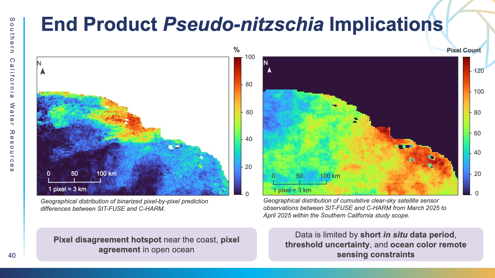

# C-HARM Comparison

### **C-HARM Comparison** &#x20;

#### &#x20;**Data Acquisition**

1. We acquired C-HARM probabilities for _Pseudo-nitzschia_ and domoic acid from the National Oceanic and Atmospheric Administration’s (NOAA) Environmental Research Division's Data Access Program (ERDDAP) portal.&#x20;
2. C-HARM generates daily nowcasts (predicted daily conditions) and 3-day forecasts for the probability that the concentration of _Pseudo-nitzschia_ blooms exceeds 10,000 cells/L, pDA level (probability of DA cell abundance ≥ 500 ng/L in phytoplankton), and cellular toxicity (probability of DA ≥ 10 pg/cell of _P. spp_) (LaHaye, Luis, & Gierach, 2026).

#### **Data Processing**&#x20;

1. In order to be able to compare SIT-FUSE’s self-supervised HAB detections with C-HARM’s nowcast probability predictions, we adopted the grid matchup and statistical validation workflow established by LaHaye, Luis, and Gierach (2026) for our study scope. Daily continuous C-HARM probabilities (0.0 to 1.0) were aligned with their SIT-FUSE satellite counterparts, on days where there was a satellite overpass matchup.
2. Both datasets were then split into binary layers representing active Bloom (1) and No Bloom (0) based on specific predetermined thresholds. For C-HARM’s _Pseudo-nitzschia_ probabilities, the threshold categorized anything with a probability of 0.75 or over of having  greater than 10,000 cells/L of _P spp._ as a Bloom (1). Similarly, a ≥0.75 threshold was applied to C-HARM's particulate domoic acid probabilities, to denote Bloom (1) events as ≥500 ng/L in phytoplankton. For SIT-FUSE, all values ≥2 were categorized as a Bloom (1), since 10,000 cells/L was the lower bound for this class's bin (LaHaye, Luis, & Gierach, 2026).&#x20;
3. Coordinates pointing to invalid pixels due to landmasses, non-overlapping pixels or heavy cloud cover for example, were assigned an identifier of -1.0 to represent the lack of data at that pixel and masked out to isolate a strictly shared observational area consistent across both C-HARM and SIT-FUSE. &#x20;
4. Because predictive models like C-HARM and satellite observations ingested by SIT-FUSE have fundamentally distinct spatial resolutions, we performed a spatial resampling to achieve pixel matchups on a pixel-by-pixel basis. C-HARM outputs data on a regional ocean model grid of \~3 km resolution, while SIT-FUSE's products are at a standardized resolution of 4 km.&#x20;
5. This interpolation utilized the nearest-neighbor k-dimensional tree resampling algorithm, which quickly is able to assign values to a new grid cell based on the closest neighboring cell. This algorithm looks at points within a 10 km radius to ensure the highest possible spatial coverage across the resampled area without creating gaps in data near grid intersections. The resulting spatial array isolates the localized geographical distribution of prediction differences to focus on the Southern California coastline study area.&#x20;

#### **Data Analysis**

<figure><figcaption></figcaption></figure>

_Geographical distribution of cumulative spatial prediction differences for P. nitzschia and clear-sky satellite sensor observations between SIT-FUSE and C-HARM (March 2024 to June 2025). The pixel-by-pixel spatial agreement and mismatch zone map (left) displays percent differences on a scale of 0% (dark blue, perfect agreement) to 100% (dark red, absolute disagreement)._&#x20;

1. We compared the binarized SIT-FUSE and C-HARM outputs on a daily, pixel-by-pixel basis. From the pixels considered valid, we generated cumulative 2×2 binary confusion matrices to determine TN, FP, FN, and TP values, alongside daily F1-scores.&#x20;
2. We then compiled these cross-sensor metrics into a standardized summary database to evaluate long-term model agreement.

#### **Data Results**&#x20;

<figure><figcaption></figcaption></figure>

_4-month timeline (April 2024 to June 2025) of model comparison F1 scores and overlapping data volumes. Line plots track individual sensor F1 accuracy scores over time (left axis), while grey shaded bars indicate total overlapping spatial pixel volume per month (right axis)._

* Given that PACE utilizes hyperspectral imagery rather than multispectral data, it is exciting that SIT-FUSE's known PACE capabilities have expanded to achieve clear consistency against C-HARM as well as older sensors throughout this new study period.​
* In the bottom panel for particulate domoic acid, scores look almost identical to the scores tracking the physical algae cells themselves. While a satellite cannot physically determine chemical toxins from orbit, the DA consistency with size classes proves SIT-FUSE successfully extracts the underlying environmental signatures associated with high-toxicity events.​
* Looking at the gray background bars, we included our total pixel count to show the sheer volume of valid data points ingested to produce these scores per month. Comparing June 2024 to June 2025, our data volume and F1 scores return to the exact same baseline. This year-over-year consistency shows that SIT-FUSE has truly learned the cyclical patterns of the Southern California upwelling ecosystem.&#x20;
* C-HARM overall had the highest agreement with SIT-FUSE closer to a “belt” along the coastline, with values around 0.8 and farther from the main ocean, with values around as low as 0.&#x20;

#### Case Study Implementation&#x20;

<figure><figcaption></figcaption></figure>

* Looking at the case study time period from March to April 2025, with C-HARM, there tends to be a pixel disagreement hotspot **near the coast**, and pixel agreement in the **open ocean**.
* Data is often limited by short _**in situ**_**&#x20;data** period, **threshold** uncertainty, and **ocean color** remote sensing constraints.&#x20;

