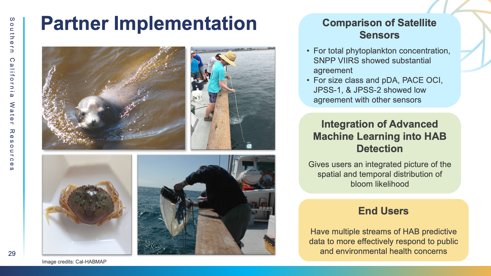
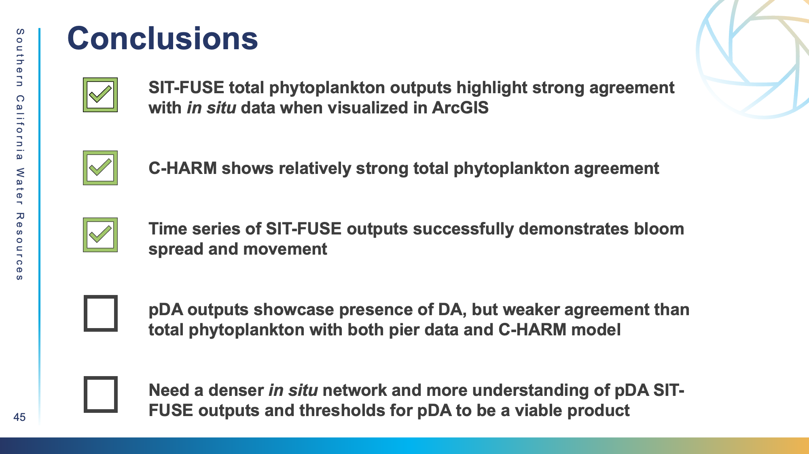

# Conclusions

### **Key Takeaways**

#### Partner Implementation&#x20;

<figure><figcaption></figcaption></figure>

The primary goal of our project was to give end users a more integrated picture of the spatial and temporal distribution of bloom likelihood. Understanding which sensors have stronger agreement with one another can allow for new diverse, integrated models with better accuracy and spatial and temporal coverage. In the future, Earth observation-based frameworks like SIT-FUSE could effectively complement existing models such as C-HARM to provide end users with multi-stream predictive HAB data to effectively respond to public and environmental health concerns facing Southern California communities. ​

#### **Limitations and Errors**

There are a few sources of possible errors in our study:&#x20;

1. We used a 10 km radius to define valid satellite–_in situ_ matchup to accommodate the fixed pier observations nearshore. While this is a commonly used approach, it can introduce spatial mismatch. Additionally, we were limited to 8 pier stations that measured our parameters of interest during our study period. ​
2. Second, we applied a C-HARM probability threshold of 0.75 to indicate the presence of _Pseudo-nitzschia_, consistent with previous studies. However, this threshold is generalized and not directly tied to local bloom dynamics, highlighting the need for further refinement and validation.​
3. Lastly, matchup availability between satellite and _in situ_ data is limited. Differences in satellite overpass and _in situ_ collection frequency mean that many satellite scenes lack corresponding _in situ_ measurements; this results in relatively few same-day matchups for context assignment and validation. We also encountered environmental and observational limitations, preventing accurate retrieval of ocean color in optically complex waters.​

#### Case Study Conclusions

<figure><figcaption></figcaption></figure>

1. Overall, SIT-FUSE **total phytoplankton** outputs highlight strong agreement with _in situ_ data when visualized in ArcGIS. C-HARM also shows relatively strong total phytoplankton agreement. The time series of SIT-FUSE outputs successfully demonstrates bloom spread and movement.&#x20;
2. In terms of the **pDA** products, pDA outputs showcase presence of DA, but weaker agreement than **total phytoplankton** with both the pier data and C-HARM model for this case study snapshot. We need a denser _in situ_ network and more understanding of pDA SIT-FUSE outputs and thresholds for pDA to be a viable product​​.

#### **Final Thoughts**

Overall, results support SIT-FUSE ingestion of Earth Observation data as a viable complimentary strategy for HAB monitoring in California to existing models such as C-HARM. The current C-HARM model utilizes data from VIIRS, but cross sensor comparison, which sensors have stronger agreement with one another can allow for new diverse, integrated models with better accuracy and spatial and temporal coverage.&#x20;

1. **SIT-FUSE Validation:** **Sentinel-3 OLCI A/B OLCI** and **PACE OCI** show strongest performance against _in situ_ validation, with F1 scores of 1 and 0.84, respectively.​ While all SIT-FUSE products performed well (F1 ≥0.75), **particulate domoic acid** (pDA) showed the strongest _in situ_ validation (F1= 0.89) overall, which bodes well for further research of pDA as a future product.&#x20;
2. **C-HARM Comparison:** Long-term coastal disagreement between C-HARM and SIT-FUSE concentrates in northern waters, indicating satellite retrieval errors in regions that are optically complex and hard to analyze.​ **Size classes** and **pDA** show high overall consistency with C-HARM across the seasons, proving SIT-FUSE captures cyclical seasonal upwelling.&#x20;
3. **Cross Sensor Agreement:** **Total phytoplankton** concentration shows substantial agreement across sensors looking at Kappa Scores (up to k=0.73), supporting SIT-FUSE's capabilities across sensors to identify blooms. **​Size classes** and **pDA** show poor cross-sensor agreement, suggesting this framework would benefit from combining like sensors.​

SIT-FUSE opens a world of possibilties for future applications of Earth Observation data for HAB detection and many other environmental use cases.&#x20;

####
