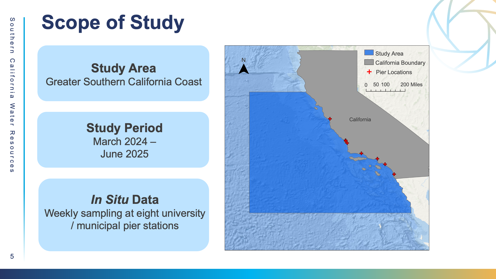
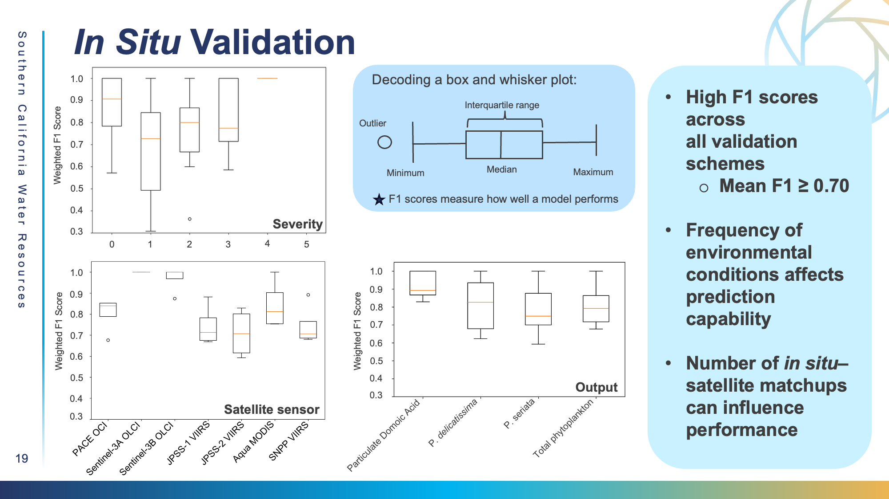
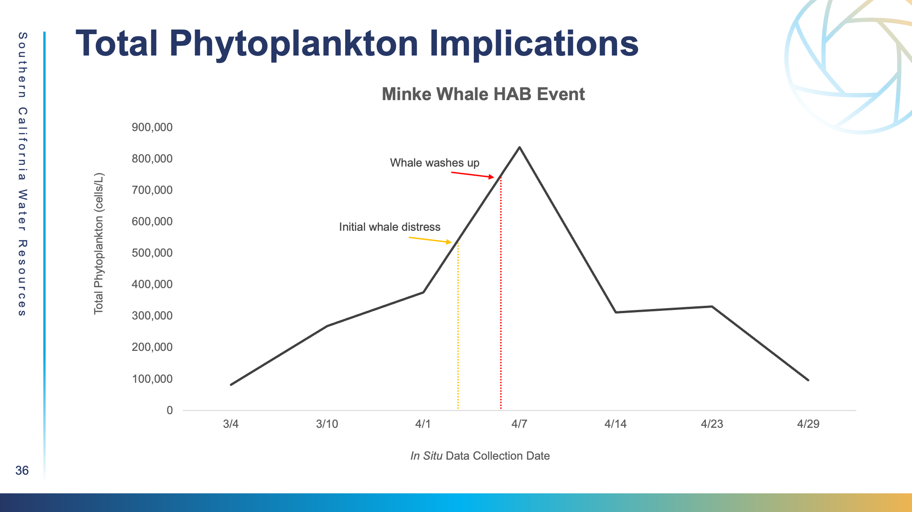

# In Situ Validation

### _**In Situ**_**&#x20;Data**

#### **Data Acquisition**

<figure><figcaption></figcaption></figure>

1. We obtained _in situ_ data through the California Harmful Algal Bloom Monitoring and Alert Program via the program website ([https://calhabmap.org/](https://calhabmap.org/)). We selected pier data from eight locations along the Southern California coast and downloaded data across 2024-2025.
2. Parameters of interest include: cell counts (cells/L) of total phytoplankton, _Pseudo-nitzschia_ (cells/L) broken down by size classes _P. delicatissima_ and _P. seriata_, and particulate domoic acid (pDA, nanograms/L).&#x20;

#### **Data processing**&#x20;

1. We processed Level 3 sensor inputs using the SIT-FUSE framework described by LaHaye, Luis, and Gierach (2026) for self-supervised representational learning and deep clustering. Level 3 satellite data is data that has been atmospherically corrected and re-gridded, making it easier to use.&#x20;
2. SIT-FUSE is trained using self-supervised learning, meaning the data is organized into clusters by similarity that initially lack specific HAB severity labels. This is known as "context-free segmented data." In order to add that environmental HAB context to the data, we used the _in situ_ database from March 2024 to February 2025 for context assignment to match the clusters to severity levels (or conditions) observed in the field.
3. We performed context assignment on the coarser Layer 1 context-free segmented data, applied it to the finer-scale Layer 2 data, resulting in daily products (total phytoplankton, _P. delicatissima_, _P. seriata_, and particulate domoic acid) for all satellite scenes.&#x20;
4. Due to the pier station’s proximity to land, we defined a radius of 10 km (0.09°) as the threshold within which a same-day pixel–_in_ _situ_ matchup is considered valid. In other words, if a pixel overlaps with the radius around the pier, that particular matchup can be used for validation.&#x20;
5. We binned cell counts for total phytoplankton and size classes using a standardized categorical framework (LaHaye, Luis, & Gierach, 2026).&#x20;
6. The SIT-FUSE framework has of six bins representing cell abundances ranging from not present to very high (≤10,000,000 cells/L).&#x20;
7. We categorized particulate domoic acid concentrations similarly using a six-tier framework corresponding to ranges measured by Perry et al. (2023), ranging from not present to very high (≤1,000 ng/L). Across parameters, we referred to these categorical bins as severity levels in this study (0-5).&#x20;

#### **Data Analysis**&#x20;

1. To assess SIT-FUSE performance, we constrained the generated outputs and _in situ_ observations to our study period from March 2025 through June 2025 and evaluated them in a matchup framework. We kept the 10 km (0.09°) radius around the pier station as the spatial threshold for valid pixel–_in situ_ comparisons, which matches with the above criteria used in context assignment.&#x20;
2. For each satellite scene within the validation period, we extracted the SIT-FUSE–predicted severity level at the pier station location and compared it against the same day _in situ_ observation. We conducted comparisons for every product individually, with agreements evaluated across all defined severity levels. We summarized the resulting matchups using confusion matrices and F1 scores.

#### **Data Results**&#x20;

<figure><figcaption></figcaption></figure>

* We compiled the F1 scores grouped by sensor platform, SIT-FUSE product, and severity class into box and whisker plots. The F1 Scores were high across the board, with the mean F1 score >/= 0.70.
* **Sentinel-3A and -3B** performed the best by instrument, when comparing the medians, while JPSS1 and JPSS2 VIIRS were the weakest.&#x20;
* Out of all the products, **pDA** performed the best by far and had the highest F1 score, with an F1 score around 0.9, while the phytoplankton metrics remain relatively comparable.&#x20;
* A **severity level of 4** had the highest F1 score median, compared to a **severity level of 1**, with a large range and a low median of data.
* The frequency of environmental conditions, as well as the number of _in situ_ satellite matchups can have a large impact on the performance of the model. &#x20;

#### **Case Study Implementation**&#x20;

<figure><figcaption></figcaption></figure>

* To visualize the minke whale case study, we chose to use **SNPP VIIRS** as our primary sensor. SNPP VIIRS has a moderate overall F1 score and an reasonable amount of _in situ_ data by the Newport Pier, the closest pier to the site, which was beneficial for satellite-_in situ_ matchups. SNPP VIIRS also showed high predicted total phytoplankton outputs in ArcGIS.&#x20;
* When conducting a thorough validation of SIT-FUSE outputs, considering a) the abundance of data, b) predictive capabilities of each individual sensor, and c) the accuracy of different HAB severity labels is necessary for a thorough evaluation.&#x20;

