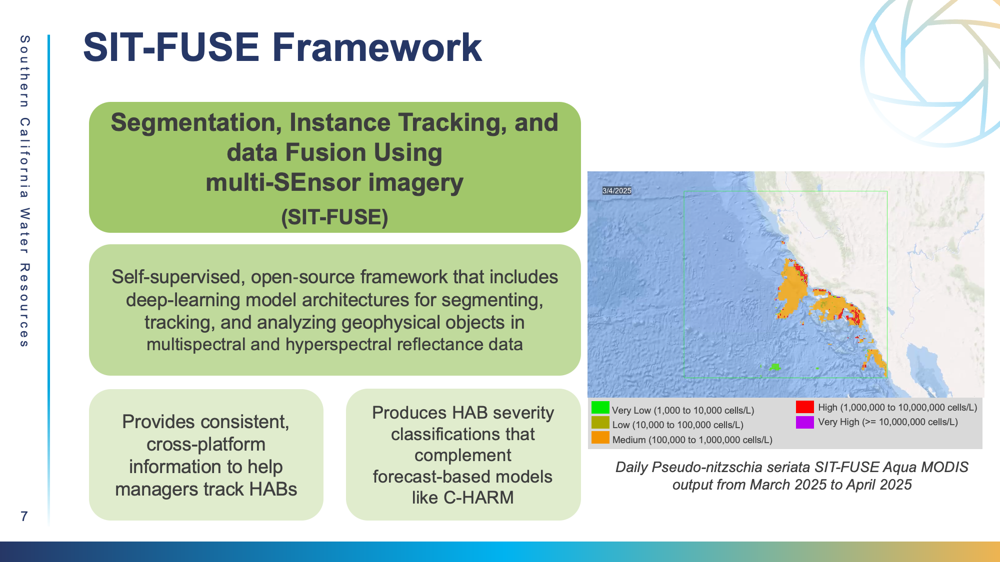

# Validation Code Introduction

#### Where to access the _in situ_ validation code for our project?

<figure><figcaption></figcaption></figure>

1. Start from [https://github.com/nlahaye/SIT\_FUSE](https://github.com/nlahaye/SIT_FUSE) main page.
2. Inside this branch, go to src/sit\_fuse > pipelines > habs > hab\_validation\_analysis\_ERDA.py. This is where SIT-FUSE validation analysis metrics  are created.
3. &#x20;If one has the output file, this code can simply be run by using: python src/sit\_fuse/pipelines/habs/hab\_validation\_analysis\_ERDA.py "D:\path\_to\_pickle\_file\output\_vals.pkl".
4. Within the habs folder, hab\_post\_inference\_pipeline.py is what creates the output files that are then analyzed in the validation analysis tab.&#x20;

#### **How does the output code work?**

Once the framework has completed the "inference" stage using the satellite imagery, the script takes the HAB severity classes assigned to each pixel and attaches all the useful environmental metadata. This data is organized and structured into a Python dictionary which is then saved as a file called output\_vals.pkl. Pickle (pkl) files are a binary file format that is generated by Python to store complicated python structures.

To summarize, the output code performs the validation between SIT-FUSE predictions and _in situ_ data, and those results are what is stored in the pickle file.

#### **How does the validation code work?**&#x20;

The validation code then takes this output file. This stores many validation records which are each single comparisons between between model/_in situ_ matchups. At every pixel that overlaps with pier locations across every satellite scene, the validation code compares the severity level that SIT FUSE predicted and the severity level actually measured. The script categorizes agreement as true positive, true negative, false positive, and false negative. The validation script is able to process each sample, compare and record agreement with _in situ_ data, and summarize this information for the whole dataset. From there, it is able to generate confusion matrices, F1 Scores, and box plots.&#x20;

To summarize, the validation analysis code allows the user to extract the pickled data and results, as well as to organize and compare results between sensors, products and severity level. It puts results into confusion matrices, calculates F1 scores, plots F1 scores as box and whisker plots, and exports a csv with human readable data because pickle files are not actually readable.
