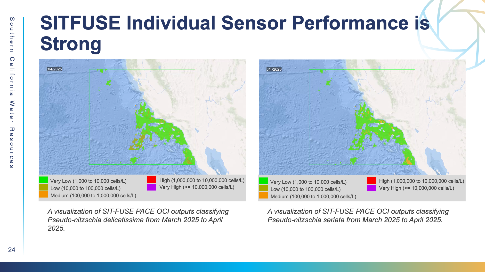
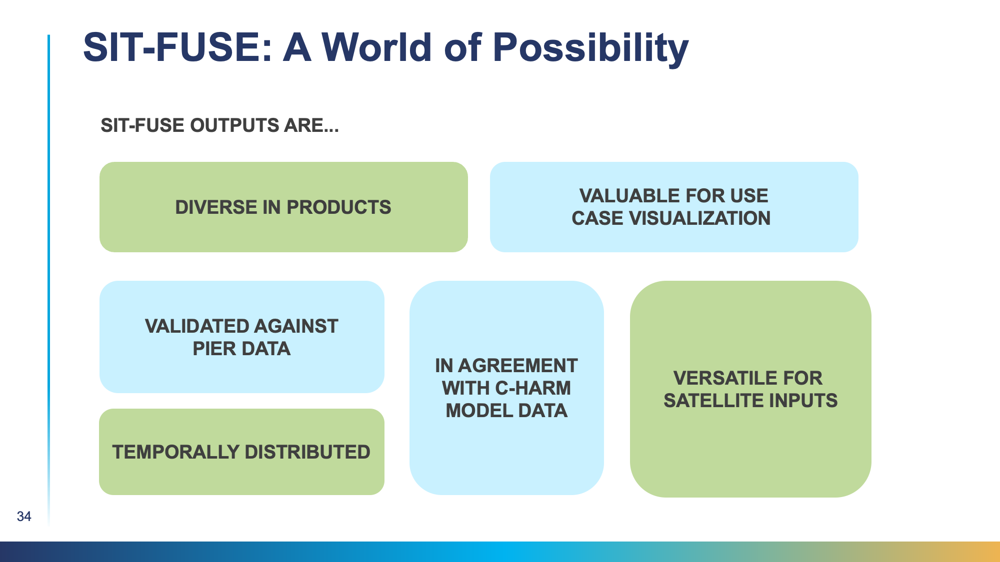

# Inter Sensor Agreement

### **Inter Sensor Agreement** &#x20;

#### **Data Processing (Creation of Time Series Visualization)**

<figure><figcaption></figcaption></figure>

1. To visualize the SIT-FUSE products, we first evaluated the model outputs and bloom progression for _P. delicatissima, P. seriata_, total phytoplankton, and pDA to create a per-sensor continuous time series of the outputs generated by the SIT-FUSE model. This allowed us to visualize the bloom extent over time.&#x20;
2. In ArcGIS Pro (Version 3.7.1), we then created a mosaic dataset for each sensor and each SIT-FUSE product and populated them with their corresponding SIT-FUSE output rasters. We set the resampling type to Nearest Neighbor, and set the time slider to match the temporal range of the data. Nearest Neighbor resampling assigns each new pixel the value of its nearest neighboring pixel, rather than interpolating between them, which preserves the discrete class values.
3. We matched our visualization style and severity class to the methodology outlined by LaHaye, Luis, and Gierach (2026).

#### **Inter Sensor Agreement Analysis**&#x20;

1. We assessed agreement between sensors for each output product to determine how consistently SIT-FUSE classified the same location and date when it processed data from two different platforms.&#x20;
2. For every unique pair of sensors, we identified sets of rasters sharing common dates between the two sensor folders and kept only dates with an output from both sensors for comparison. We masked pixels with a value of –1, and the remaining valid pixels were flattened into vectors that were paired and processed through Python library scikit-learn's confusion\_matrix using a label set of \[0, 1, 2, 3, 4, 5]. This allowed for easy comparison between severity values of two different sensors.&#x20;
3. We generated a confusion matrix for each overlap date, then summed the per-data matrices into a total confusion matrix for each sensor pair and output product (pairwise), which allowed us to assess agreement both scene-by-scene and in total across the full comparison period.&#x20;
4. In addition to the pairwise sensor comparison, we compared each sensor against the pooled outputs of all the other sensors for a given species. We also compared each sensor against the pooled outputs of all other sensors for a given species (a one-versus-all comparison). For each target sensor, we identified overlapping dates against every other sensor and applied the same confusion matrix process described above.
5. For both the pairwise and one-versus-all comparisons, we visualized the total confusion matrix as a heatmap and normalized each row to sum to 100%. This normalization shows that for a given severity class assigned by the reference sensor, the percentage of pixels each comparison sensor placed in every other class. &#x20;
6. To evaluate inter-sensor consistency, we calculated quadratically weighted Cohen's Kappa coefficients (k). We computed this once per sensor/per output for the pairwise comparison and once per sensor/per output for the one-vs-all comparison. This metric accounts for chance agreement and penalizes disagreement between sensors in proportion to the distance between the matched classes. Because of this, one-class difference (e.g., Low misclassified as Medium) contributes substantially less to the error than a multi-class difference (e.g., Not Present misclassified as Very High).&#x20;

#### **Data Results**&#x20;

<figure><figcaption></figcaption></figure>

_Confusion matrices depicting sensor agreement, Cohen’s Kappa Coefficients, and overlapping date counts compared for SNPP VIIRS total phytoplankton concentration versus all combined sensors._&#x20;

Total Phytoplankton

* Inter sensor comparisons of total phytoplankton concentration showed moderate to substantial agreement across platforms overall, SNPP VIIRS reflected the strongest agreement across sensors.&#x20;
* Confusion matrices showed most comparisons falling within one to two classes of the diagonal, with an elevated number of matches in class 4 across sensor/class pairings.
* Pairwise comparisons with SNPP VIIRS support this pattern as well, as agreement between SNPP VIIRS and JPSS1 VIIRS, MODIS Aqua, and PACE OCI reflects substantial agreement across platforms both carrying the same instrument and not. Overall, these results highlight how total phytoplankton concentrations are reasonably consistent across sensor platforms.

Size Class and Toxin

* In contrast to agreement between total concentration products, agreement collapsed between size class and toxin classification products.&#x20;
* PACE OCI _P. seriata_ values compared against all other sensors had less than slight agreement. JPSS2 VIIRS _P. delicatissima_ classification compared against all other sensors and JPSS2 VIIRS pDA compared against all other sensors had agreement marginally worse than what would be expected by random chance. &#x20;
* For all three, the majority of comparisons cluster into single vertical classes, with the majority of paired observations falling into class 1 regardless of which individual sensor and class it was being compared to. This pattern held across all individual sensor pairings for _P. seriata, P. delicatissima_, and particulate domoic acid. &#x20;

#### Case Study Implementation&#x20;

<figure><figcaption></figcaption></figure>

* The SIT-FUSE time series visualizations give SCOOS and Cal-HABMAP a way to track bloom spread and severity over time, offering a monitoring layer that complements existing pier-based sampling and operational C-HARM model.&#x20;
* Inter sensor agreement results show where SIT-FUSE outputs were consistent enough across platforms to support confident visualization and interpretation.
* As using _in situ_ observations is time, resource, and labor intensive to sustain, this visualization helps fill spatial and temporal gaps between sampling.
