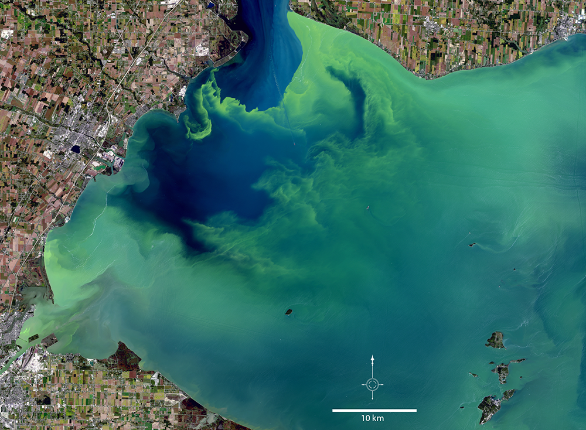

# Harmful Algal Bloom Example

### Certain environmental conditions in water bodies can intensify algae growth, causing algal blooms. Harmful Algal Blooms (HABs) are large outbreaks of algae in oceans and lakes that harm coastal ecosystems, fisheries, and public health, has increased.&#x20;

Monitoring these blooms has been expensive and difficult historically – algal blooms change rapidly and tracking requires instrument-specific retrieval algorithms, which can be difficult and expensive to develop. SIT-FUSE enables continuous, large-scale monitoring of HABs that would be difficult to achieve manually and is compatible with many satellite and airborne instruments.&#x20;



**include flow chart of process**



<figure><figcaption>
JPSS1-VIIRS SIT-FUSE Clustered Output 
</figcaption></figure>



<figure><figcaption>
JPSS1_VIIRS SIT_FUSE Context Assigned Output - Pseudo Nitchia Seriata (PNS)
</figcaption></figure>



<figure><figcaption>
Figure 2. A hazardous algal bloom containing the toxin microcystis covered large portions of western Lake Erie in September 2017. Credit: USGS EROS
</figcaption></figure>

