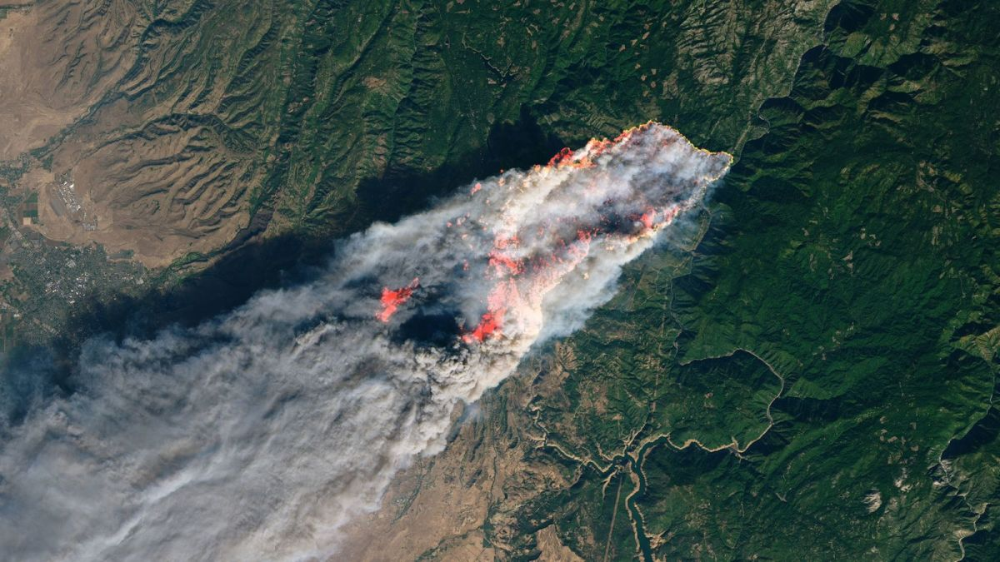

# Wildfire Example

### Over the last few years, there has been a sharp increase in number and length of wildfires. Around the world, they pose a significant threat to ecosystems, public health, and infrastructure.&#x20;

Monitoring these wildfires is critical to minimizing the threats they pose. Accurate and timely detection allows scientists, policymakers, and emergency responders to assess risk, allocate resources, and take action before impacts escalate. SIT-FUSE enables continuous, large-scale monitoring that would be impossible to achieve manually, helping ensure that decision-makers have the best available information to respond quickly and effectively.

<figure><figcaption>
Credit: NASA Applied Sciences
</figcaption></figure>

Below are steps to assign context to wildfire imagery that has been processed by SIT-FUSE.

***


[labeling-tutorial](labeling-tutorial/)



[zonal-histogram](zonal-histogram/)



[class-comparison](class-comparison/)



[geotiff-generation](geotiff-generation/)



[contours.md](contours.md)

